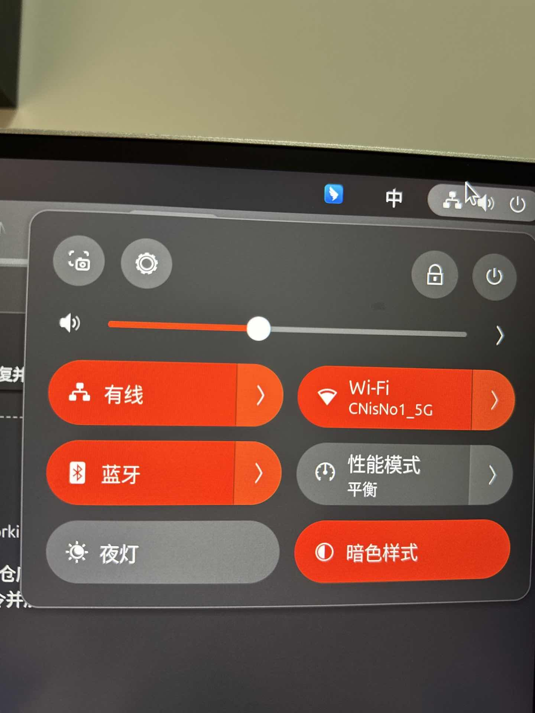

e1000e-driver-3.8.7;
port-for-linux-6.17;

### Why modify this driver codebase.

- Using Intel I219-LM. Ubuntu 24.04

### Install

```
cd ./src

# 1. 编译生成的模块文件
ls -la e1000e.ko

# 2. 安装驱动（复制到系统目录并更新 initramfs）
sudo make install

# 如果 make install 报错，手动安装：
# sudo cp e1000e.ko /lib/modules/$(uname -r)/kernel/drivers/net/ethernet/intel/e1000e/
# sudo depmod -a
# sudo update-initramfs -u

# 3. 卸载旧驱动（如果正在运行）
sudo modprobe -r e1000e

# 4. 加载新驱动
sudo modprobe e1000e
```

### Check if it works.

```bash
ip link show

ethtool -i eth0 2>/dev/null || ethtool -i enp0s31f6 2>/dev/null
```



